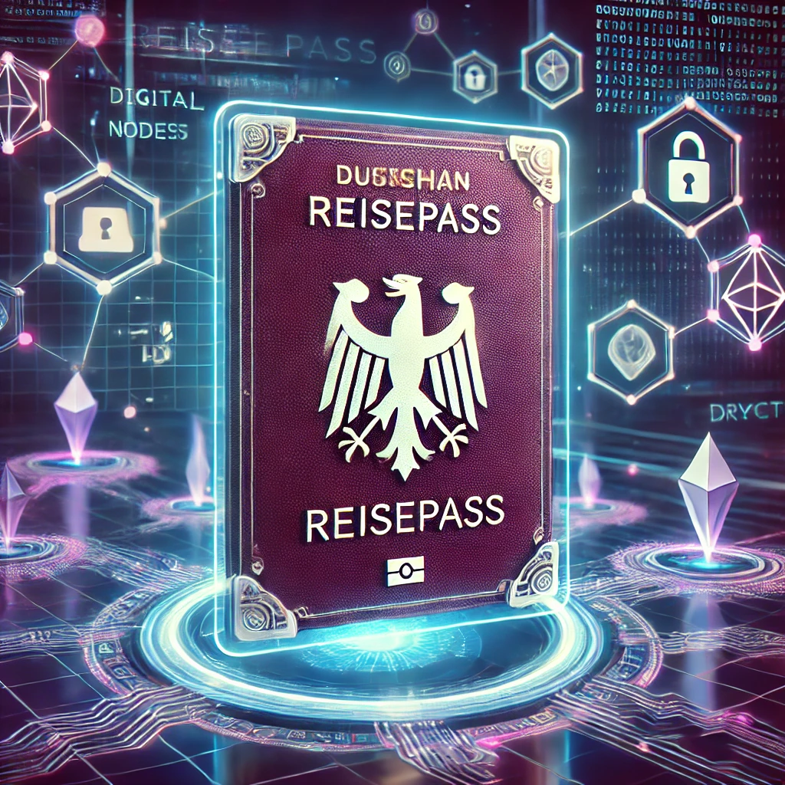
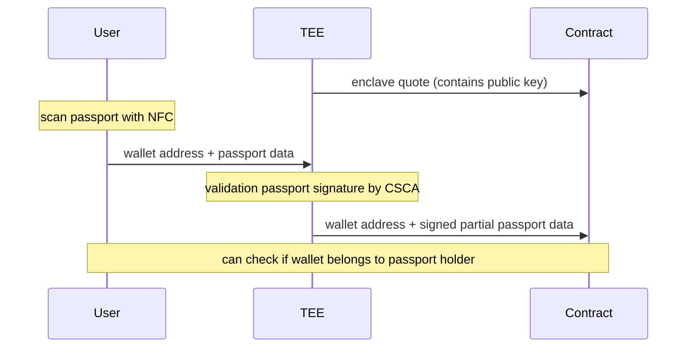

# Pass-Tee-Port

Verified association between Ethereum address and partial passport information

## Overview

We use NFC to scan a passport and securely transmit the data to a Trusted Execution Environment (TEE). When the TEE is created, its attestation quote is submitted on-chain to prove that the TEE and its cryptographic keys are genuine and hardware-backed.

The TEE then verifies that the scanned passport was signed by a legitimate government authority. It extracts and signs customizable attributes—such as confirming the holder is over 18—without revealing the full passport data.

This signed proof is submitted on-chain and linked to an Ethereum address. The owner of that address is now verified as a unique passport holder, and selective disclosures (e.g., age verification) can be cryptographically proven when needed.

## Repository Structure

The repository consists of three main components:

- `/pass-scanner` - Code to scan the information from a passport
- `/enclave` - Code that runs inside the enclave to validate the passport and generate a signed data
- `/smart-contracts` - Smart contract to validate TEE and read/write the data from TEE

## How It Works

Reading Data from the Passport
Parsing passport data is notoriously difficult. Governments didn’t follow standard practices and instead implemented their own complex formats and cryptographic schemes, making the process far from straightforward.

Trusted Execution Environment (TEE)
The TEE generates its own keypair (private/public). To prove that this keypair was securely generated within a real enclave, the TEE produces an attestation quote. This quote can be submitted on-chain to register the public key as a trusted TEE identity.

When a user scans their passport, they submit both the passport data and their Ethereum address to the TEE. The TEE validates the passport by verifying that it was signed by an official government authority. A unique ID is then derived from the passport, ensuring that the same document cannot be used multiple times.

The TEE extracts selected attributes—such as whether the user is over 18—without revealing sensitive personal data. It then signs a message containing the unique ID, extracted attributes, and Ethereum address using its private key.

Smart Contracts
The smart contract includes two key functions:

Register TEE Key
Allows a verified public key (attested by an enclave) to be added as a trusted TEE key.

Submit Verified Passport Data
Accepts signed messages from registered TEE keys. If the signature is valid and the ID has not been used before, the passport attributes are linked to the provided Ethereum address, and the ID is marked as used.

If the same ID is submitted again (i.e. reused passport), the contract will first clear any existing data linked to the previous address before updating the new one.

## Getting Started

1. Read passport data 

2. Start TEE

3. Validate TEE

4. Generate signed message of partial data (with TEE)

5. submit signed message onchain

6. check that address has been linked to passport

## Enclave verification

Grab binary from enclave. 
`curl http://3.108.76.30:1300/attestation/raw -vs -o attestation_hack.bin`

Binary should be passed to contract for verification in prod like so:
`nitroProver.verifyAttestation(attestation_doc (.bin), pcrs, max_age);`

