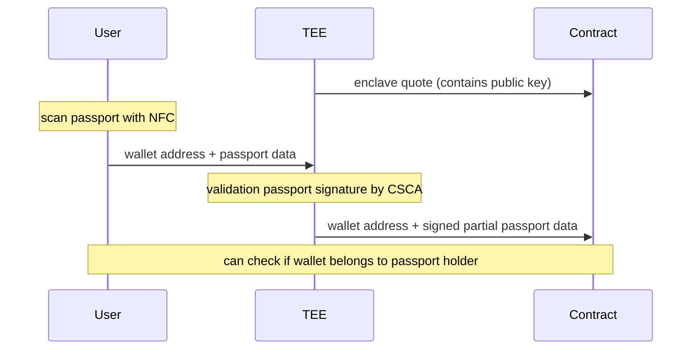

# Pass-Tee-Port

Verified linkage of partial passport details to address on ethereum

## Overview

We use NFC to scan the passport. 
Sumbit the scanned information of the passport to a TEE.
The TEE verifies the passport was signed by the government.
Extracts and signes some customisable data, such as > 18 years old.
This will then be submitted onchain, where it will be linked to an address.
The owner of that address is now a verified unique passport holder and specific information can be disclosed such as > 18 years old.

## Repository Structure

The repository consists of three main components:

- `/pass-scanner` - Code to scan the information from a passport
- `/enclave` - TEE code
- `/smart-contracts` - Smart contract to submit TEE onchain

## How It Works

Reading the data from passport:
Its complicated as hell, because goverment didn't use anything normal and made their own shit.

TEE:
The TEE generates a private/public key pair. The public key will then be attestated to ensure it was indeed generated inside an enclave. This attenstation can then be sent onchain to allow this keypair to submit passport infos.
The person scanning his passport sends his passport data, aswell as the wallet address he wants to link it to, to the TEE. The TEE first validates that the passport is indeed valid by checking if the provided signature is indeed signed by the official goverment authorities.
A unique ID will be calculated for that person ensuring that the same passport can't be used multiple times. Some data will be extracted, such as >18 years old.
The ID, data and eth address will be signed by the private key.

Contracts:
The contracts has 2 mutable functions. 
One to add a keypair as a valid TEE, which allows messages signed by it to be sumitted to the other function.
This function takes a signed message. If the message has been signed by a verified TEE the passport data will be mapped to the provided address and the ID will be marked as used.
If the ID is used again, it will first clear the data on the old linked address.

## Getting Started

1. Read passport data 

2. Start TEE

3. Validate TEE

4. Generate signed message of partial data (with TEE)

5. submit signed message onchain

6. check that address has been linked to passport

